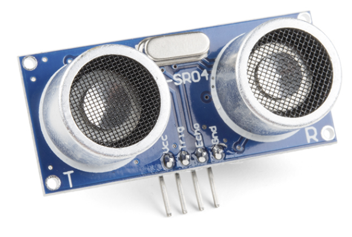
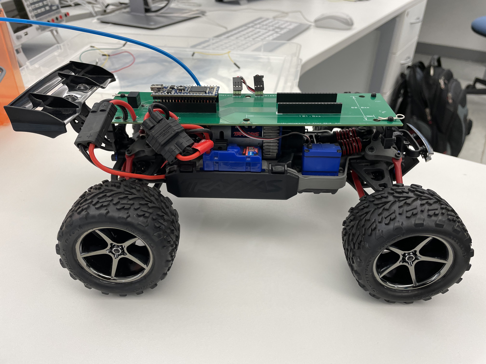

# ARM Mbed Obstacle Avoidance Car

This project was created as part of my second year Team Project for University of Essex. I developed the movement code for the RC Car as well as the code for obstacle avoidance using HCSR04 Ultrasonic Sensors. **This was a great learning experience for Embedded Software development in C/C++**.

## Components Used:
- HCSR04 Ultrasonic Sensor

IMAGE ([source](https://www.sparkfun.com/products/15569)):

- RC Car (Provided by the University):

- ARM Mbed Cortex M3 (LPC1786).

## Libraries used:

- I used Prabhu Desi's HCR04 sensor library to read distance from the Ultrasonic sensors. Link: [HCSR04 Library](https://os.mbed.com/users/prabhuvd/code/HCSR04/).
- The official built in API provided from ARM was used as well.

## Overview of the code:

- **main.cpp** - Does all the main logic, using the distance values to turn the car away from the object, by moving left or right or reversing the car. The functions are all defined in the movement.h header file.
- m**ovement.h** - A header file defining all the functions/methods used.
- **movement.cpp** - Defines all the logic for the turning of the car, and contains all the methods for turning the car, measuring the distance etc. The RC car's brushless motors are all controlled via Pulse Width Modulation.
